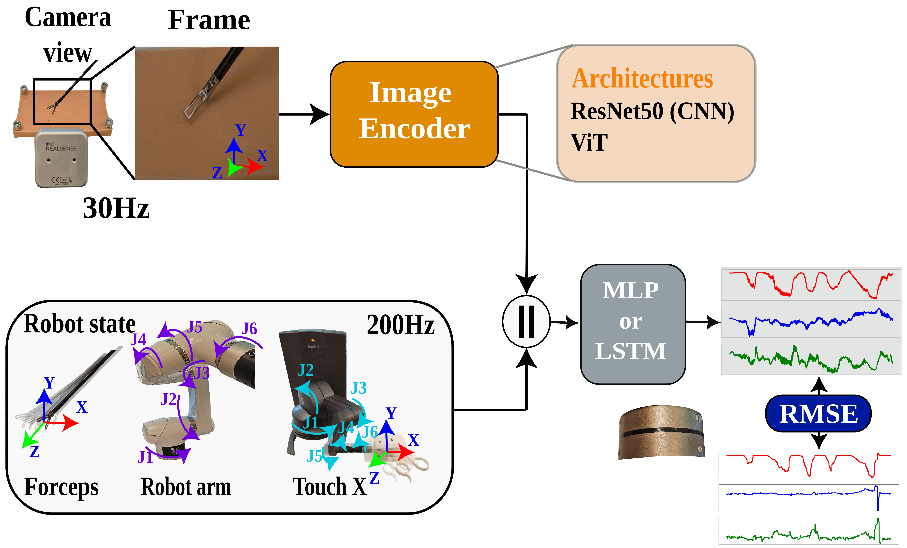
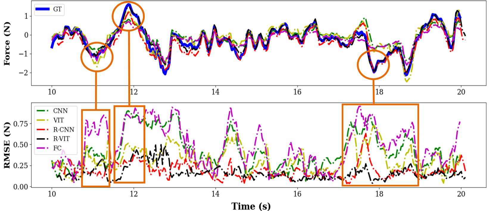

# DaFoEs

Implementation of the models presented in the paper "DaFoEs: Mixing <u>Da</u>tasets Towards the generalization of vision-state deep-learning <u>Fo</u>rce <u>Es</u>timation in Minimally Invasive Robotic Surgery" to appear on RA-L 2024.


*Experimental setup for the collection of our custom vision and force dataset (DaFoEs) for the training on the different models presented on this paper.*

><font size = 4>[**DaFoEs: Mixing <u>Da</u>tasets Towards the generalization of vision-state deep-learning <u>Fo</u>rce <u>Es</u>timation in Minimally Invasive Robotic Surgery**]()</font>,
>
>[Mikel De Iturrate Reyzabal](https://kclpure.kcl.ac.uk/portal/en/persons/mikel-de-iturrate-reyzabal(54d8acc4-29b6-4ea6-855c-3d25077e13f4).html), Mingcong Chen, Wei Huang, , [Sebastien Ourselin](https://www.kcl.ac.uk/people/sebastien-ourselin), [Hongbin Liu](http://kclhammerlab.com/people/hongbin-liu/)
>
>*RA-L 2024 ([link](https://ieeexplore.ieee.org/abstract/document/10410871))*

## Models

The [*models*](models) folder contain multiple scripts to build the different models presented on our paper.



The list of models and the different combinations for the encoder and decoder can be found on the table below:

|       **Decoder**       |     **Encoder**    | **Network name** |
|:-----------------------:|:------------------:|:----------------:|
| **MLP (Non-recurrent)** |      ResNet50      |        CNN       |
|                         | Vision Transformer |        ViT       |
|                         |   Fully connected  |        MLP       |
|   **LSTM (Recurrent)**  |      ResNet50      |       R-CNN      |
|                         | Vision Transformer |       R-ViT      |


The main model constructor can be found on [*models/force_estimator.py*](models/force_estimator.py). The class **ForceEstimator** can be initialized with the following variables:

* **architecture**: A string that contains one of the possible 3 encoders ("cnn", "vit" or "fc").
* **recurrency**: Boolean to add recurrency to the model
* **pretrained**: Boolean to load the weights of the pre-trained ResNet50 or ViT model from Pytorch.
* **att_type**: Add some attention blocks to the CNN encoder
* **state_size**: The size for the state vector

## Setup the environment

The following code has been tested with *Python3.11*. Setup the *conda* environment to run the code.

```shell
conda create -n dafoes python=3.11
conda activate dafoes
pip3 install -r requirements.txt
```

## Training

The scripts are adapted for the use on our two available dataset, however it can be adapted to any custom dataset of your preference. The [*train.py*](train.py) file contains an example for a simple training loop on how to train the force estimation model.

```python3
python3 train.py --dataset <your-dataset-name> --architecture <desire-decoder> --recurrency
```

To include your custom dataset update the content on [*datasets/vision_state_dataset.py*](datasets/vision_state_dataset.py).


## Testing

To test the model use the following command:

```python3
python3 test.py --dataset <your-dataset-name> --architecture <trained_architecture> 
```

## Results

Our reduced temporal sampling and the use of a vision transformer based decoder showed better performance on predicting the temporal evolution of the forces.




## License and copyright

Please see the [LICENSE](LICENSE) file for details.

## Acknowledgement

Special thanks to Zhonge Chua for sharing their dataset from his article [[1]](#1) with us for this project

## Citation

If you find this code or this research useful, please consider citing our work:

```bibtex
@ARTICLE{10410871,
  author={Reyzabal, Mikel De Iturrate and Chen, Mingcong and Huang, Wei and Ourselin, Sebastien and Liu, Hongbin},
  journal={IEEE Robotics and Automation Letters}, 
  title={DaFoEs: Mixing Datasets Towards the Generalization of Vision-State Deep-Learning Force Estimation in Minimally Invasive Robotic Surgery}, 
  year={2024},
  volume={9},
  number={3},
  pages={2527-2534},
  keywords={Robots;Force;Training;Estimation;Phantoms;Task analysis;Sensors;Deep learning in grasping and manipulation;surgical robotics: Laparoscopy;computer vision for medical robotics},
  doi={10.1109/LRA.2024.3356984}}
```

## References

<a id="1">[1]</a>
Chua, Z., Jarc, A. M., & Okamura, A. M. (2021, May). Toward force estimation in robot-assisted surgery using deep learning with vision and robot state. In 2021 IEEE International Conference on Robotics and Automation (ICRA) (pp. 12335-12341). IEEE.

